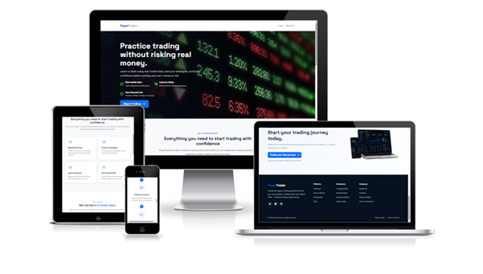
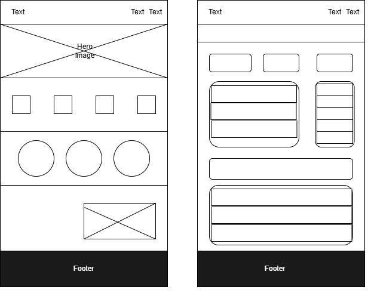
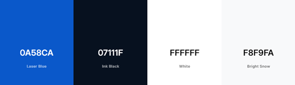
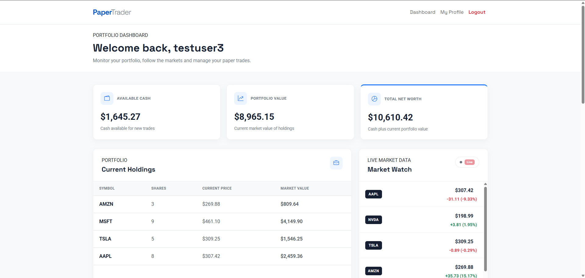
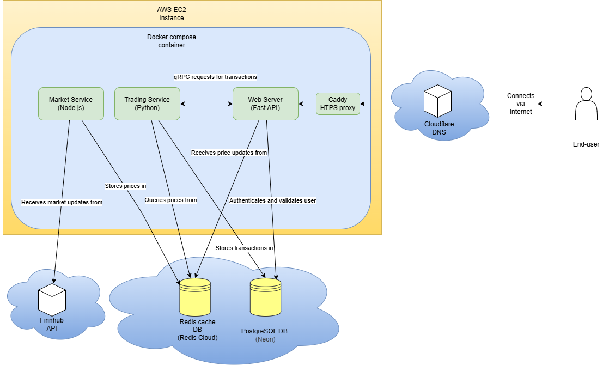
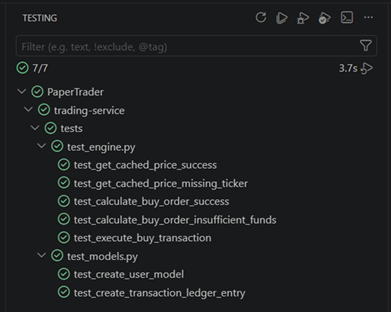
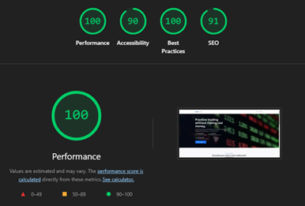

# PaperTrader

##### by Juan A. Boccia

Learn to trade without risking real money

> PaperTrader is a web-based paper trading application that allows users to experiment with stock trading using real market prices, without risking real money. The platform is deliberately kept relatively simple, with a focused interface and a small number of companies, so users can concentrate on the basics of buying, selling and managing a portfolio.

### [Live site](https://papertrader.cc/) | [Repository](https://github.com/jbocciadev/PaperTrader)

## UX and Design

PaperTrader was designed with simplicity in mind. Stock trading platforms can present a large amount of information, which can make them intimidating for someone who is only starting to learn about investing. The intention was therefore to provide a clean and relatively uncluttered interface, while still giving the user enough information to make simulated trading decisions.

### Wireframes

---

### Colour Palette

The colour palette was chosen with a finance-related technology platform in mind. The interface uses Bootstrap components and utilities, with customisation applied to give the site its own visual identity.

---

### Responsive Design

The application was developed primarily with desktop use in mind, but the main pages were designed to remain usable on smaller screens.

---

## Project Overview

### Overview

PaperTrader is a paper trading platform designed to allow users to practise stock trading without making a real financial investment.

The application uses real market prices supplied by Finnhub, while all transactions are simulated. Each new user receives an initial virtual balance of $10,000 which can be used to buy and sell shares.

The main purpose of the project was not to reproduce the full functionality of a commercial trading platform. Instead, the focus was on providing a relatively simple environment where someone could experiment with the basic mechanics of trading and see how their decisions affect a portfolio.

### Target Audience

The main target audience is people who are interested in learning about stock trading but do not necessarily have the experience or confidence to use a real trading platform.

This includes beginners, younger users who may be interested in investing, and anyone who wants to experiment with buying and selling shares without putting real money at risk.

### Site aspirations

PaperTrader aims to provide:

- A simple environment for experimenting with stock trading.
- Real and regularly updated market prices.
- Simulated BUY and SELL transactions.
- A virtual portfolio and transaction history.
- A clear interface without the amount of information normally found on professional trading platforms.
- A platform that can be accessed remotely through the internet.

---

## Functionality

### User signup and login

Users can register for an account and subsequently log in to access their portfolio.

Authentication is handled by the web server and protected routes prevent unauthenticated users from accessing dashboard and profile information.

### Dashboard

The dashboard is the main area of the application. It provides the current market watch, the user's portfolio summary and the controls required to carry out simulated trades.

Market prices are updated through a WebSocket connection rather than requiring the user to refresh the page.

### Buying and selling

Users can select an available stock and enter the number of shares they wish to trade.

The trading service checks the request before executing it. A purchase is rejected when the user does not have enough virtual funds, while a sale is rejected when the user does not own enough shares.

The execution price is obtained by the trading service from the Redis price cache rather than being supplied by the browser or web server.

### Portfolio

The portfolio displays the stocks owned by the user and their current value.

As market prices change, the front-end recalculates the relevant holding values so that the user can see the effect of price movements without manually refreshing the page.

### Transaction history

Previous transactions are retained in PostgreSQL and displayed to the user so that their trading activity can be reviewed.

### Profile and account management

The profile page provides account management functionality, including resetting the account and deleting it.

Account reset restores the initial virtual balance and clears the user's trading records. Account deletion removes the account and its associated records.

---

## Under the Proverbial Hood

### System architecture

PaperTrader uses a microservices architecture with three main application services:

1. **Market Service** – a Node.js service responsible for obtaining market data from Finnhub and maintaining the Redis price cache.
2. **Trading Service** – a Python service responsible for validating and executing transactions and recording them in PostgreSQL.
3. **Web Server** – a FastAPI application responsible for the user interface, authentication and communication with the other services.

The application also uses two databases and an external market data API.

---

### Market Service

The Market Service connects to Finnhub in two ways.

At startup, it obtains an initial snapshot of the selected stock prices through the Finnhub REST API. It then maintains a WebSocket connection to receive subsequent price updates.

The latest values are stored in Redis using ticker-specific keys. This provides the other services with a central location from which the latest market prices can be retrieved.

The service is deliberately separated from the rest of the application so that an issue with the market feed does not necessarily prevent users from accessing their portfolios or the rest of the application.

---

### Trading Service

The Trading Service contains the main business rules for buying and selling stocks.

When a user submits a trade, the Web Server sends a gRPC request containing the user ID, ticker, quantity and trade type. The Trading Service then checks the user's balance or holdings, retrieves the execution price from Redis and carries out the transaction when the relevant conditions are met.

Successful transactions are recorded in PostgreSQL and the user's cash balance is updated.

Keeping this logic outside the presentation layer means that the rules governing transactions are not dependent on the web interface.

---

### gRPC

gRPC is used for communication between the Web Server and Trading Service.

The main transaction method is `ExecuteTrade`, which uses a unary gRPC call. The request contains the information needed to identify and validate the trade, while the response contains the result of the operation and the execution price used.

The service definitions and messages are maintained in a `.proto` file.

---

### Databases

Two different databases are used for different purposes.

#### PostgreSQL

PostgreSQL is used for persistent information, including:

- User accounts
- Hashed passwords
- Cash balances
- Transaction records

#### Redis

Redis is used as a cache for the constantly changing market prices.

This separation means that transient market data and persistent user information are not stored together.

---

### Authentication and Security

User passwords are hashed before being stored in PostgreSQL.

JWT tokens are used to maintain authenticated sessions and expire after one hour. Routes such as `/dashboard` and `/profile` are protected and require a valid token.

Environment files containing credentials and API keys are excluded from the public repository through `.gitignore`.

---

### Front-end

The front-end uses Jinja templates together with Bootstrap.

Two main JavaScript files handle the live dashboard behaviour:

- `ticker-stream.js` maintains the WebSocket connection and updates market prices in the browser.
- `holdings.js` recalculates holding values when new market data is received.

---

## Tech Stack

The following technologies were used to develop and run PaperTrader:

- Python
- FastAPI
- Node.js
- JavaScript
- gRPC
- PostgreSQL
- Redis
- Docker
- Docker Compose
- Caddy
- AWS EC2
- Finnhub API
- Jinja / Jinja2
- Bootstrap
- pytest
- Git
- GitHub
- VS Code

---

## Development

### Version control

The chosen IDE for development was [VS Code](https://code.visualstudio.com/).

Git and GitHub were used throughout development to maintain the project repository and track changes.

Repository:

[PaperTrader on GitHub](https://github.com/jbocciadev/PaperTrader)

Development was carried out using feature branches where appropriate, with changes tested locally before being merged into the main branch.

---

### Agile Development

Agile development practices were used to maintain focus on the requirements during the eight-week project.

User stories were used to define functionality, and requirements were prioritised using a MoSCoW-style approach. Features that were not considered essential to the MVP were moved into the backlog when time or implementation complexity made them impractical.

The project also maintained a traceability matrix linking the functional requirements to the relevant implementation and verification method.

---

## Testing

### Unit testing

Automated unit testing was implemented using pytest, mainly around the Trading Service and its business logic.

Testing was more limited than originally intended because of time constraints and limited previous experience with automated testing.

### Manual / Alpha testing

Once the front-end was available, manual end-to-end testing was carried out against the deployed application.

Testing covered:

- Landing page navigation
- Registration
- Login and invalid credentials
- Protected routes
- Market price updates
- Buying and selling
- Portfolio calculations
- Transaction history
- Account reset
- Account deletion
- Responsive behaviour

A detailed testing matrix is included in the project documentation.

One issue identified during testing was occasional delays in the market watch updates. The application remained usable, but this is an area for future improvement.

### Google Lighthouse

Google Lighthouse was used to assess performance, accessibility, best practices and SEO.

The final performance score reached 100%. Improvements made following earlier Lighthouse testing included converting the landing page image to WebP and pre-loading Bootstrap stylesheets.

### User testing

Informal user testing was carried out with friends and acquaintances across different age groups.

The results were generally positive, particularly regarding usability and the value of the application as a learning tool. The testing population was limited, so the results should not be considered representative of a wider user population.

---

## Deployment

PaperTrader has been deployed to an AWS EC2 instance and is available online.

The application is containerised using Docker. Each of the three main services has its own Dockerfile, while Docker Compose is used to orchestrate the services.

Caddy is used as the reverse proxy and handles HTTPS/TLS termination, HTTP to HTTPS redirection and certificate acquisition and renewal.

The domain is registered through Cloudflare and its DNS configuration directs traffic to the deployed EC2 instance.

The deployment process was one of the more challenging parts of the project, particularly the configuration of HTTPS. Nginx and Certbot were initially investigated before Caddy was selected as a simpler solution.

---

## Known Issues

The project was delivered as an MVP and there are some known limitations.

- Market price updates can occasionally become slow or stop temporarily.
- Some footer section links on the landing page have not been implemented.
- The application is primarily designed for desktop use, although the main pages are responsive.
- The feature set is intentionally smaller than that of a commercial trading platform.

These issues did not prevent the application from fulfilling its main purpose, but they provide useful starting points for future development.

---

## Further Development

Several ideas remained in the backlog that could be explored in a future version:

- Portfolio charts and historical performance graphs
- Dividend payouts
- Short selling
- ETFs, futures and other financial products
- Live financial news
- Company information cards
- Custom watchlists
- Email notifications
- Dark mode
- Further mobile optimisation
- Leaderboards and gamification

A leaderboard or group competition could be particularly interesting in an educational setting, where classes or groups of friends could compare their simulated trading performance.

---

## Credits and References

The project made use of official documentation and other resources while implementing the technologies listed above.

The main technical resources used during development included:

- Finnhub API documentation
- gRPC documentation and examples
- FastAPI documentation
- pytest documentation
- Redis / Upstash documentation
- PyJWT documentation
- Docker documentation
- AWS EC2 documentation
- Caddy documentation
- Bootstrap documentation

Additional resources and documentation are listed in the technical report.
